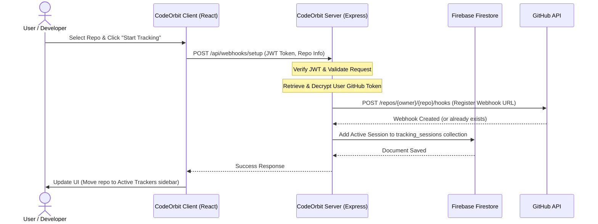
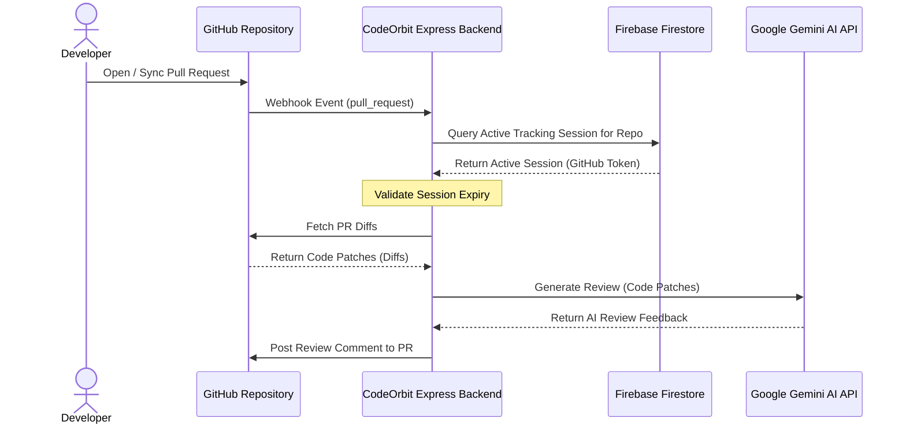

<p align="center">
  
</p>

<h1 align="center">CodeOrbit</h1>

<p align="center">
  <strong>Everything around your code ecosystem.</strong><br />
  An AI-powered GitHub Pull Request reviewer that automatically posts code quality feedback, optimization suggestions, and bug detection comments directly onto your PRs.
</p>

<p align="center">
  
  
  
  
  
</p>

---

## 🌟 Project Overview

**CodeOrbit** is a modern, full-stack, AI-powered automation tool designed to streamline code review workflows. By integrating directly with GitHub Webhooks and utilizing Google's advanced **Gemini 2.5 Flash** model, CodeOrbit analyzes codebase diffs on incoming Pull Requests and immediately generates inline feedback. 

With CodeOrbit, developers can authenticate, link their GitHub accounts, choose which repositories to track, and set active tracking durations. Webhook registration is handled automatically behind the scenes, offering a frictionless setup experience.

---

## ✨ Key Features

*   🤖 **AI-Driven Code Reviews**: Leverages Google Gemini 2.5 Flash to inspect PR code patches, identify bugs, suggest optimizations, and ensure coding best practices.
*   ⚡ **Automated Webhook Management**: Programmatically configures webhook subscriptions (`pull_request` events) for GitHub repositories using personal OAuth/Access tokens.
*   🕒 **On-Demand Tracking Duration**: Choose how long to track a repository (from 1 to 30 days). Expired sessions automatically stop webhook actions.
*   🛡️ **Secure Session Storage**: Uses Firebase Firestore via the backend Firebase Admin SDK to keep track of active sessions and securely store tokens.
*   🔒 **Server-Side Token Storage & Encryption**: GitHub Access Tokens are never stored on the client side (e.g., `localStorage`). They are linked via a secure backend endpoint and stored encrypted at rest in Firestore using **AES-256-GCM** encryption. All GitHub API requests are proxied securely through the backend.
*   🔍 **Client-Side Repo Search & Filter**: Instantly search and filter through fetched repositories client-side before starting a tracker.
*   🗂️ **Accordion Configuration**: The Configure Tracker panel expands directly inline under the selected repository card (accordion-style), complete with an explicit Cancel action.
*   📊 **Dynamic Sidebar Statistics**: Features a dynamic statistics block in the sidebar showing the number of Repos Tracked and live PR Reviews Posted (summed from active sessions).
*   📈 **Active Tracking Progress Bar**: Displays a live percentage completed progress bar along with a counter of processed PR reviews per tracker.
*   📅 **Localized Date Formatting**: Displays all metadata and tracker expiration dates formatted clearly as `DD/MM/YYYY`.
*   👤 **Avatar Initials Fallback**: Automatically displays a custom styled circular initials fallback badge if the user's GitHub profile photo fails to load.
*   🔐 **Secure Authentication**: Backend-mediated Email/Password authentication with custom JWT token storage and optional Firebase client state synchronization.
*   🎨 **Clean & Responsive UI**: Built with a clean, high-utility UI optimized for both desktop and mobile viewports, featuring dark/light mode toggle support.

---

## 📐 System Architecture

### 1. Repository Tracking & Webhook Setup Flow


### 2. Pull Request Code Review Pipeline


---

## 🛠️ Technology Stack

### Frontend
*   **Vite + React 19**
*   **Firebase Client SDK** (Used only for authentication custom token synchronization)
*   **Lucide React** (Vector Icons)
*   **React Router DOM** (Navigation and Routing)
*   **Custom Vanilla CSS** (Responsive UI with dark/light theme switching)

### Backend
*   **Node.js & Express**
*   **Firebase Admin SDK** (Used for Firestore and user registration sync)
*   **Google Generative AI SDK** (`@google/generative-ai`)
*   **GitHub REST API** (Diff retrieval and PR comment submissions)
*   **JSON Web Token** (`jsonwebtoken` for secure backend session handling)

---

## 🚀 Getting Started

Follow these steps to run CodeOrbit locally on your machine.

### Prerequisites
*   [Node.js](https://nodejs.org/) installed (v18+ recommended)
*   A [Firebase Project](https://console.firebase.google.com/) with Authentication (Email, Google, and GitHub providers) and Cloud Firestore enabled.
*   A Google AI Studio [Gemini API Key](https://aistudio.google.com/).
*   A GitHub Personal Access Token (with `repo` permissions to read files and post comments).

---

### 📂 Repository Structure
```
CodeOrbit/
├── backend/            # Express.js Server
│   ├── config/
│   │   └── firebaseAdmin.js # Firebase Admin initialization
│   ├── routes/
│   │   ├── auth.js     # JWT authentication, signup & login routes
│   │   └── webhooks.js # Webhook programmatic setup, stopping, and listener
│   ├── services/
│   │   ├── aiService.js     # Google Gemini API integration wrapper
│   │   └── githubService.js # Github fetch diffs / post comments service
│   ├── index.js         # API Server entrypoint & routing configurations
│   ├── package.json
│   └── .env
└── frontend/           # Vite React App
    ├── src/
    │   ├── assets/      # Image assets (Logo, Robot illustrations)
    │   ├── components/  # Shared components (ThemeToggle.jsx)
    │   ├── config/      # Firebase Client initialization (firebase.js)
    │   ├── context/     # Global state context providers (ThemeContext.jsx)
    │   ├── pages/       # Route-based page layouts (Dashboard.jsx, Login.jsx, SignUp.jsx)
    │   ├── styles/      # Application stylesheets (App.css, Auth.css, Dashboard.css, index.css)
    │   ├── App.jsx      # Main application router structure
    │   └── main.jsx     # Web application mounting point
    └── package.json
```

---

### 🔧 Setup & Installation

#### 1. Clone the repository
```bash
git clone https://github.com/your-username/CodeOrbit.git
cd CodeOrbit
```

#### 2. Backend Configuration
   Create a `.env` file in the `/backend` directory:
   ```env
   PORT=3000
   FIREBASE_PROJECT_ID=your-firebase-project-id
   FIREBASE_CLIENT_EMAIL=your-firebase-admin-sdk-email
   FIREBASE_PRIVATE_KEY="your-firebase-private-key"
   GEMINI_API_KEY=your-gemini-api-key
   JWT_SECRET=your-jwt-auth-secret
   TOKEN_ENCRYPTION_KEY=your-64-character-hex-encryption-key
   WEBHOOK_BASE_URL=https://your-public-url-or-ngrok.dev
   ```

*Install backend dependencies:*
```bash
cd backend
npm install
```

#### 3. Frontend Configuration
Create a `.env` file in the `/frontend` directory:
```env
VITE_FIREBASE_API_KEY=your-firebase-api-key
VITE_FIREBASE_AUTH_DOMAIN=your-firebase-auth-domain
VITE_FIREBASE_PROJECT_ID=your-firebase-project-id
VITE_FIREBASE_STORAGE_BUCKET=your-firebase-storage-bucket
VITE_FIREBASE_MESSAGING_SENDER_ID=your-firebase-messaging-sender-id
VITE_FIREBASE_APP_ID=your-firebase-app-id
VITE_BACKEND_URL=http://localhost:3000
```

*Install frontend dependencies:*
```bash
cd ../frontend
npm install
```

---

### 🏃 Running Locally

To run CodeOrbit, you'll need to spin up both the backend server and the frontend client.

#### Start the Express Backend:
```bash
cd backend
npm start
```
*The server will run on `http://localhost:3000` (or the port defined in your environment).*

#### Start the React Frontend:
```bash
cd frontend
npm run dev
```
*Vite will compile and launch the frontend, typically at `http://localhost:5173`.*

---

## 💡 How it Works Under the Hood

1.  **Authorization**: Users register and log in via email and password. The request hits the Express backend, which hashes/validates the credentials using Firebase Firestore, returns a secure JWT access token to the client, and signs in client-side Firebase Auth using a custom token to keep SDK states synchronized.
2.  **GitHub Connection**: In the dashboard, the user authorizes CodeOrbit via a Firebase OAuth GitHub popup. The resulting Access Token is sent directly to the backend `POST /api/github/link` where it is encrypted using **AES-256-GCM** and stored at rest in Firestore. The token is never exposed to browser storage. Repository fetching is proxied through the backend `GET /api/github/repos`.
3.  **Tracking Setup**: The user selects a repository from their GitHub repo grid, configures tracking duration (e.g. 7 days), and starts tracking.
4.  **Webhook Registration**: The frontend initiates a JWT-authorized POST request to the backend `/api/webhooks/setup`. The backend retrieves the user's encrypted token, decrypts it, calls the GitHub API to register a webhook listener pointing to the backend's payload URL, and creates an active session entry in the `tracking_sessions` Firestore collection with `prsReviewed: 0`.
5.  **Review Processing**: When a PR is opened, updated, or reopened, GitHub transmits a payload to `/api/webhooks/github`. The backend validates the active tracking record in Firestore, decrypts the session's GitHub token, pulls PR patch diffs, queries Google Gemini 2.5 Flash for review suggestions, posts the review directly onto the PR, and increments the `prsReviewed` count in Firestore.

---

## 📄 License
This project is licensed under the ISC License. See the [package.json](backend/package.json) file for details.
